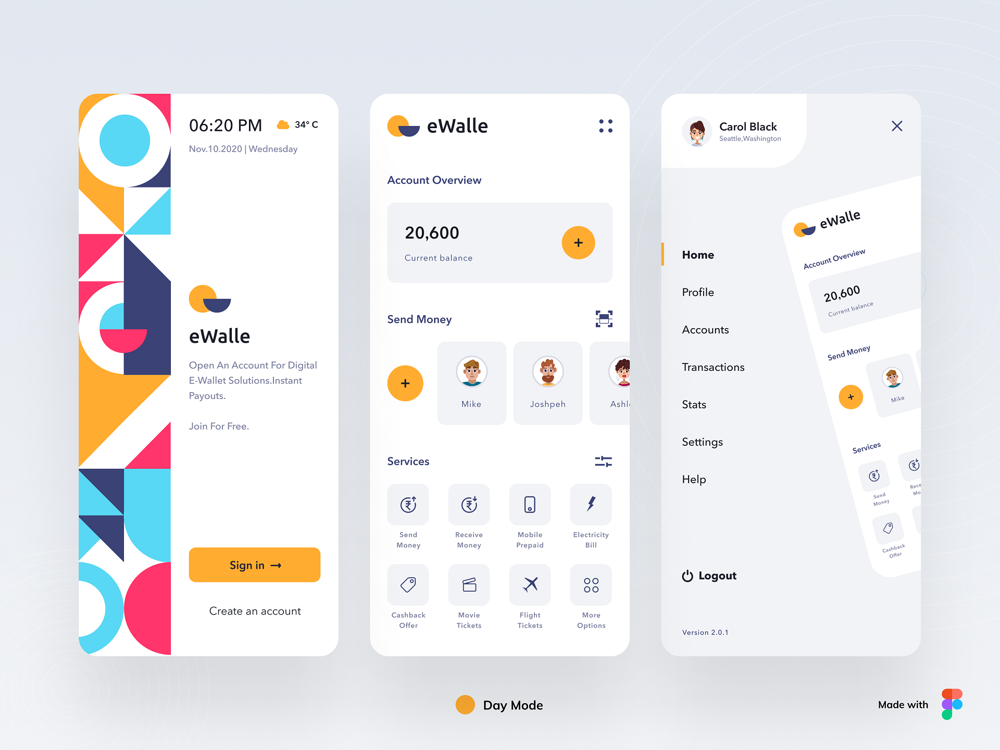

Flutter Wallet App UI — Dark & Light Themes 🌗💼

A clean, modern wallet UI built with Flutter — comes with polished Light and Dark themes and ready-to-use assets for prototypes, demos, or inspiration.

UI credit — eWalle on UpLabs

Preview

   
 
  

✨ Highlights

Beautiful, minimal wallet UI components (cards, balances, transactions)

Fully designed Light and Dark themes

Clean layout ideal for pitch decks, prototypes, and onboarding screens

Easy to drop into any Flutter project

🔧 What’s Included

assets/light.png — Light theme screenshot

assets/dark.png — Dark theme screenshot

UI widgets and example screens (copy-ready)

Theme data for quick integration (colors, text styles, icons)
