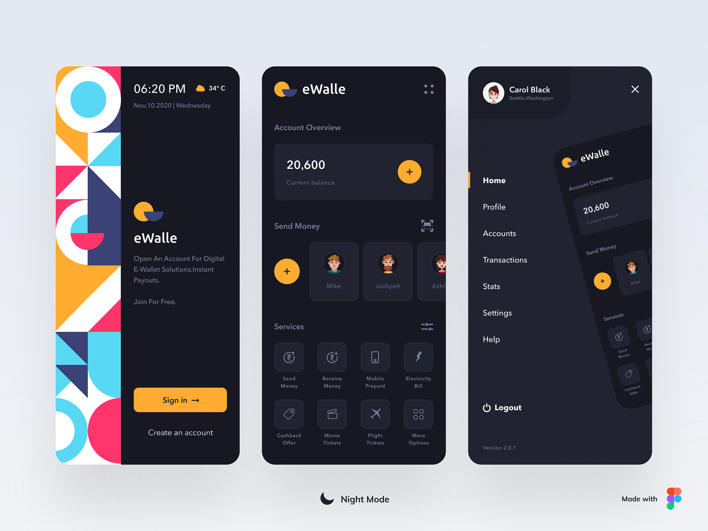

Flutter Wallet App UI — Dark & Light Themes 🌗💼

A clean, modern wallet UI built with Flutter — comes with polished Light and Dark themes and ready-to-use assets for prototypes, demos, or inspiration.

UI credit — eWalle on UpLabs

Preview

 

✨ Highlights

Beautiful, minimal wallet UI components (cards, balances, transactions)

Fully designed Light and Dark themes

Clean layout ideal for pitch decks, prototypes, and onboarding screens

Easy to drop into any Flutter project

🔧 What’s Included

assets/light.png — Light theme screenshot

assets/dark.png — Dark theme screenshot

UI widgets and example screens (copy-ready)

Theme data for quick integration (colors, text styles, icons)

🚀 Quick Start

Clone / copy the UI files into your Flutter project.

Add assets to pubspec.yaml:

flutter:
  assets:
    - assets/light.png
    - assets/dark.png

Import the theme and widgets in your app and toggle themes:

// Example
MaterialApp(
  theme: AppThemes.light,
  darkTheme: AppThemes.dark,
  themeMode: ThemeMode.system,
  home: WalletHomePage(),
);

🧩 Usage Tips

Use these screens to prototype onboarding, quick demos, or marketing mockups.

Replace placeholder data with your app’s state management (Provider/BLoC/Riverpod).

Keep accessibility in mind: test color contrast when customizing palette.

📣 Credit

Design inspired by eWalle (UpLabs) — full UI design credit to the original author. Link above.

🤝 Contributing

Feel free to open issues or PRs to:

Add new screens (send/receive, QR pay)

Improve accessibility and localization

Add animations or interactive examples

📄 License

Include your preferred license here (e.g., MIT). If you’re just sharing a prototype, consider MIT or CC-BY for design reuse.
